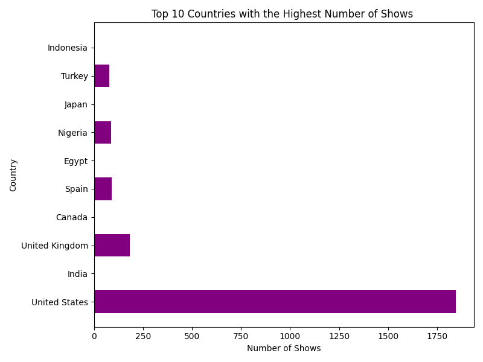
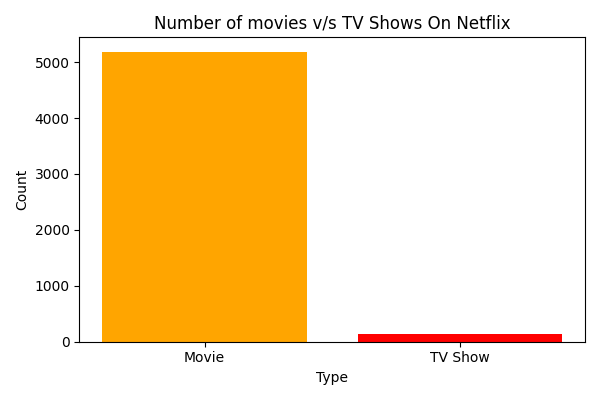
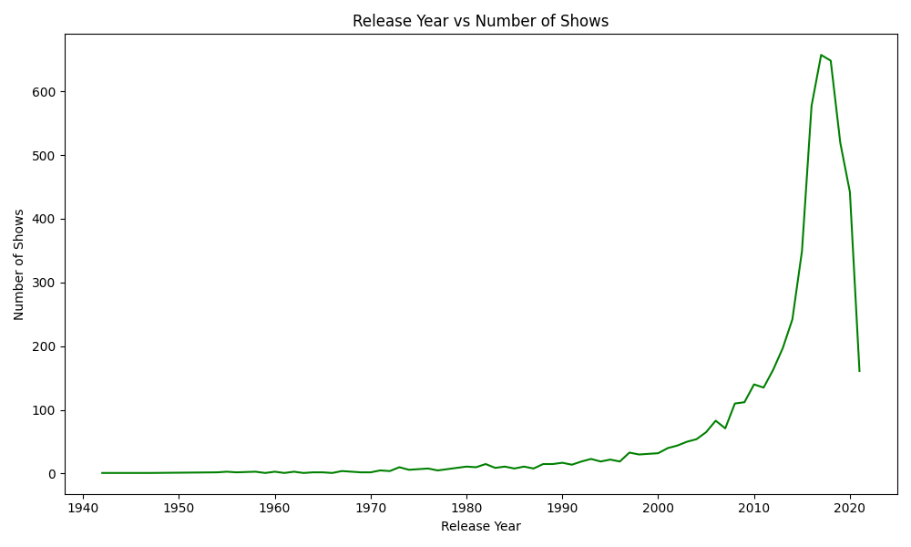

# Netflix Content Analysis & Visualization

A data science project exploring the Netflix titles dataset to uncover trends in movies vs. TV shows, global content distribution, and release patterns over time.

## 📝 Project Overview
This project uses Python to clean and visualize Netflix's library. Key questions explored:
* What is the distribution of Movies vs. TV Shows?
* Which countries produce the most content?
* How has content release frequency changed over the years?

## 📊 Visualizations
### Top 10 Countries with the Most Content

### Content Distribution: Movies vs TV Shows

### Release Trends

## 🛠️ Tools Used
* **Python** (Pandas for data manipulation)
* **Matplotlib** (Data visualization)
* **Dataset:** `netflix_titles.csv`
